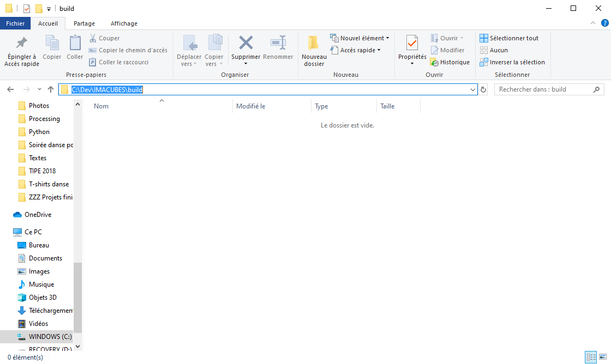
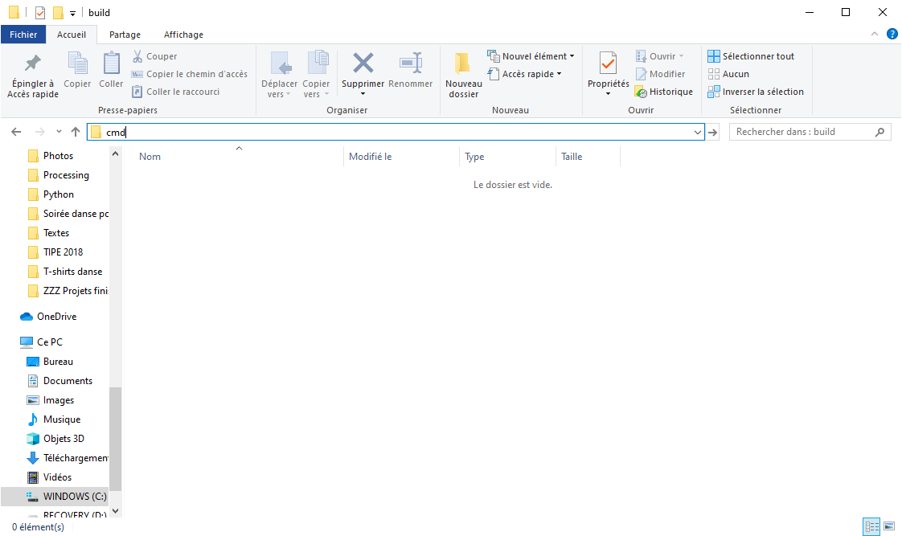
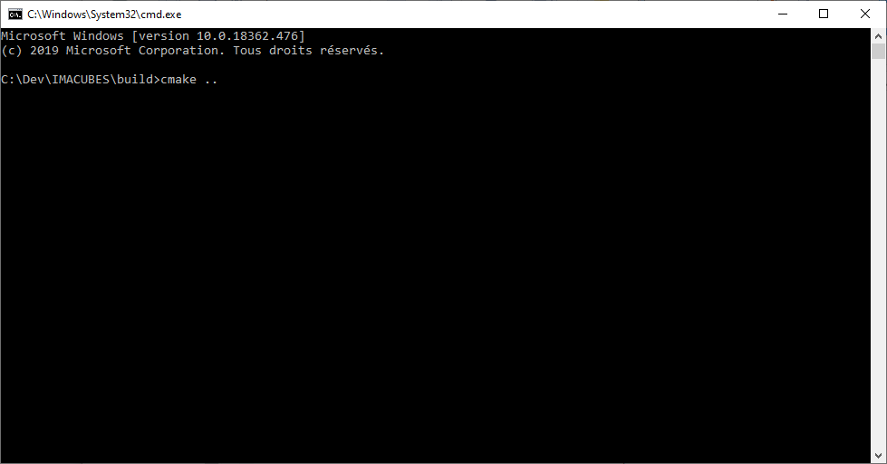
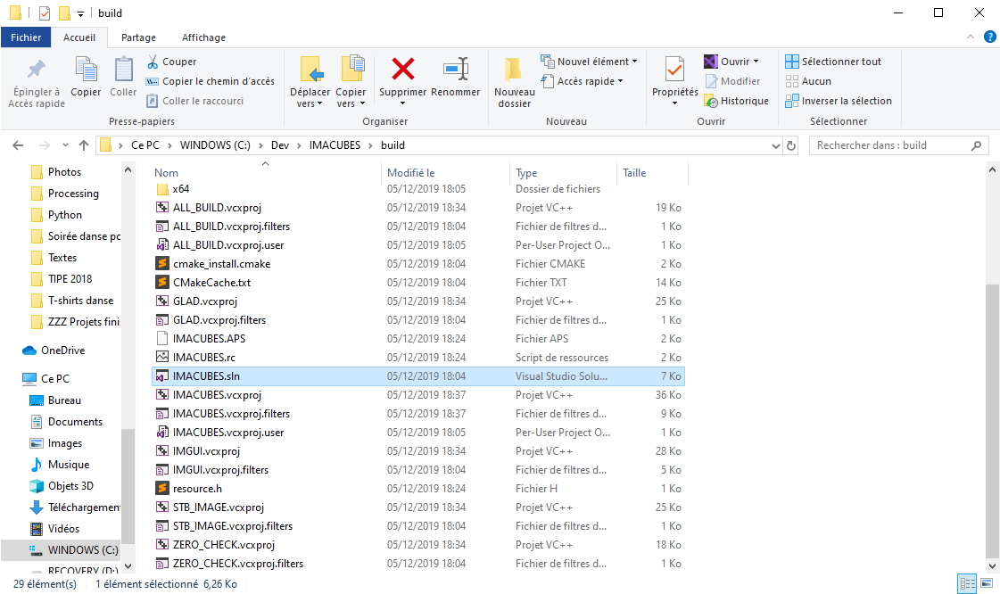
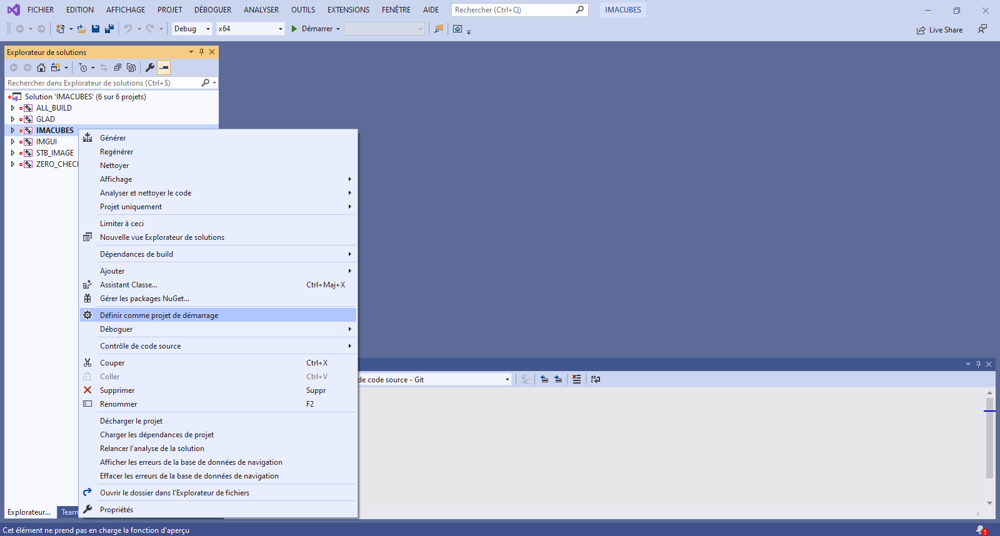
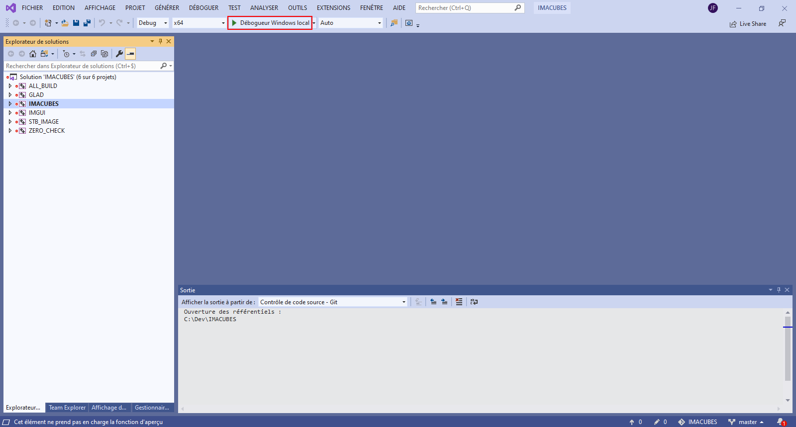

# IMACUBES

A voxel editor offering a few tools and procedural terrain generation, supporting custom shaders, shadows and ambient occlusion.

## Controls and Shortcuts

#### Camera

+ **Zoom** with wheel
+ **Rotate** by pressing wheel
+ **Translate** by pressing SHIFT  + wheel
+ **Center** on hovered cube with "c"

#### Tools

+ **Add cubes** with left clic
+ **Remove cubes** with right clic
+ **Paint on cubes** by holding SPACE
+ **Change brush size** with SHIFT + scroll  (you can specify an axis by holding "x", "c" or "v")

#### Miscelanous
+ **Pick material** of hovered cube with "b"
+ **Place selected point light** at hovered cube with "p"
+ **Add a light** of selected type with "="
+ **Switch cursor mode** with TAB. You can :
	+ Place on hovered cube (default)
	+ Place at a fixed distance from camera (you can change distance with CTRL + scroll)
+ **Move cursor** cube by cube with "z", "q", "s", "d", "w" and "x"
+ **Extrude** with "l"
+ **Dig** with "m"
+ **Reload shader** with F5
+ **Export image** with CTRL + "s"

#### Histories
+ **Move backward** with CTRL + "z"
+ **Move forward** with CTRL + "y"
(Note that we have several histories in parallel ; if you want to change the active history, go to the "Histories" tab in the main menu bar)


## How to build

To learn more about how to use CMake, vector-of-bools has a great series of videos https://www.youtube.com/watch?v=6aiV7Z9NRhk&list=PLK6MXr8gasrGmIiSuVQXpfFuE1uPT615s&index=5
Since I'm a nice guy (but only towards those who use Windows and Visual Studio) here are a few more explanations :

#### On windows : using Visual Studio 2019

First make sure you have CMake 3.8 or higher installed : https://cmake.org/download/

Then add a 'build' folder inside 'IMACUBES', go into that folder and open a command prompt (to do so you can simply select the filepath, replace it by 'cmd' and press enter !)

<p align="center">


</p>

Then you just have to type this in the command prompt :

```bash
cmake ..
```

<p align="center">

</p>

(btw you will have to type the same command each time you add a file/folder to the project to regenerate the CMakeCache and the solution)

It should automatically generate the visual studio solution and all it needs. You can now double-clic on 'IMACUBES.sln' and the project will open in Visual Studio.

<p align="center">

</p>

Now right-click on IMACUBES and select 'Set as StartUp Project'. Finally click on that lovely green triangle and you're done ! The project should build and execute just fine :wink: 

<p align="center">


</p>
